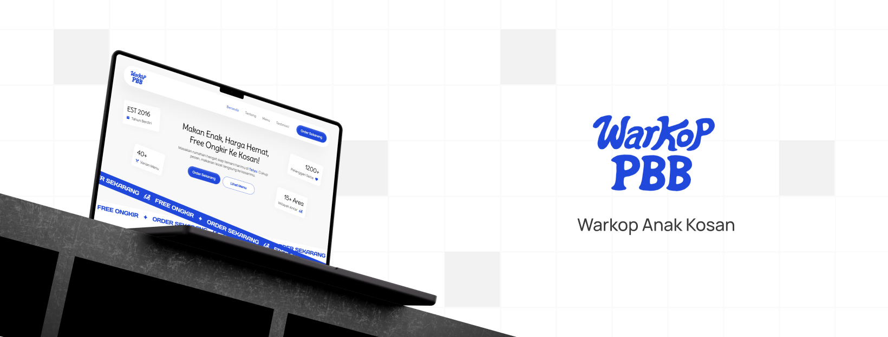

<div align="center">
  
</div>

# Warkop PBB - Warkopnya Anak Kosan
Warkop PBB adalah warung kopi legendaris yang terletak di kawasan Perumahan Buah Batu, Bandung. Lokasinya dekat dengan Telkom University sehingga menjadi tempat favorit bagi mahasiswa untuk mencari makanan cepat, murah, dan praktis.

Website ini dirancang untuk memperkuat eksistensi digital Warkop PBB dengan menampilkan menu, layanan unggulan, dan cerita dibalik dapur. Tampilan yang mobile-first dan interaktif menjadikan pengalaman pengguna lebih menarik dan menyenangkan.

Dengan fitur unik seperti "Order by Mood" dan galeri cerita dapur, website ini memberikan nilai emosional dan kedekatan antara pengunjung dan warkop.

<a name="readme-top"></a>

<!-- PROJECT LOGO -->
<div align="center">
  
  <p><strong>Warkopnya Anak Kosan</strong></p>
</div>

<div align="center">
  <h3>Made by:</h3>
  <p><strong>Christian Bryan Seputra</strong> - UI/UX Designer</p>
  <p><strong>Jeiver Junior Lahilote</strong> - Web Developer</p>
  <br />
  <a href="https://github.com/jeiverlahilote/WarkopPBB"><strong>Explore the docs »</strong></a>
  <br />
  <br />
</div>


### 🛠️ Teknologi yang Digunakan

<div align="center">


</div>

<br>

| Teknologi | Deskripsi | Peran dalam Project |
|-----------|-----------|-------------------|
| **HTML5** | Struktur konten dan semantik halaman | Membangun kerangka dasar website dengan markup semantik yang SEO-friendly |
| **Tailwind CSS** | Styling cepat, modern, dan responsif | Menciptakan desain yang konsisten dan mobile-first dengan utility classes |
| **JavaScript** | Interaktivitas dan efek dinamis | Mengimplementasikan fitur seperti mood selector, carousel, dan animasi |
| **File Modularisasi** | Pembagian struktur ke components, sections, dan js | Meningkatkan maintainability dan reusability kode |

### 🚀 Fitur Teknologi

- **Responsive Design** - Optimal di semua device (desktop, tablet, mobile)
- **Component-Based Architecture** - Struktur modular untuk kemudahan maintenance
- **Modern CSS Framework** - Tailwind CSS untuk styling yang cepat dan konsisten
- **Interactive Elements** - JavaScript untuk user experience yang dinamis
- **SEO Optimized** - HTML5 semantic markup untuk search engine optimization


## ⭐ Fitur Unggulan

- 🎭 **Order by Mood** – Rekomendasi menu berdasarkan suasana hati dengan emoji interaktif.
- 🖼️ **Carousel Menu** – Navigasi antar menu favorit secara halus dan dinamis.
- 🍽️ **Cerita dari Dapur** – Galeri hover yang menampilkan cerita dibalik dapur Warkop PBB.
- 🛵 **Free Ongkir 24 Jam** – Informasi layanan pengantaran tanpa biaya tambahan.

## Instalasi

1. **Clone** repository ini:

    ```bash
    git clone https://github.com/jeiverlahilote/WarkopPBB.git
    ```

2. **Directory** - Masuk ke direktori project:

    ```bash
    cd WarkopPBB
    ```

3. **Live on Browser** - Buka file `index.html` di browser:

    - Double click pada file `index.html`
    - Atau drag and drop file `index.html` ke browser
    - Atau gunakan live server extension di VS Code

## Cara Menjalankan

Website ini dapat dijalankan langsung di browser tanpa perlu server tambahan. Cukup buka file `index.html` di browser favorit Anda.


<p align="right">(<a href="#readme-top">back to top</a>)</p>
